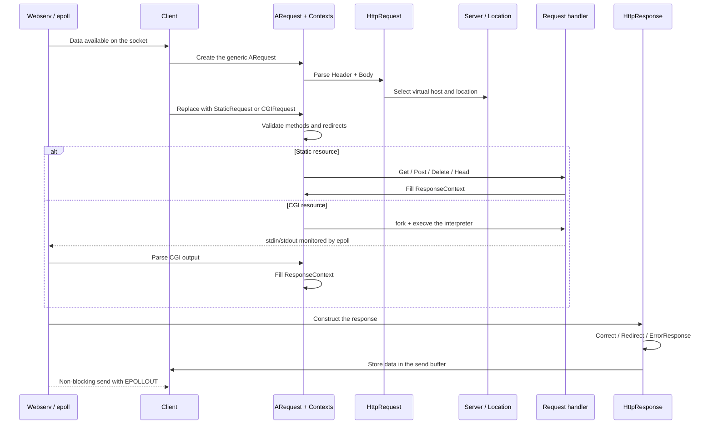

*This project has been created as part of the 42 curriculum by erpascua, fmotte.*

# Webserv

## Description

**Webserv** is a non-blocking HTTP/1.1 server written from scratch in **C++98**, without any
external library. The goal of the project is to understand how a real web server works by
re-implementing one: parsing an NGINX-like configuration file, accepting connections,
parsing raw HTTP requests, serving static files, executing CGI scripts, and returning
well-formed HTTP responses — all from a single process, single thread, using **`epoll`**
for I/O multiplexing.

The server never blocks: every socket (listening sockets, client sockets and CGI pipes) is
registered in the same `epoll` instance and handled through an event loop. A request is
read incrementally, parsed, routed to the matching `server` block and `location` block,
handled by the right method, and the response is only written when the kernel reports the
socket as writable.

Architecture overview:

```mermaid
flowchart TB
    subgraph ORCH["1 · Orchestration and configuration"]
        W["Webserv<br/>epoll · sockets · sessions"]
        S["Server<br/>virtual server configuration"]
        L["Location<br/>route and directives"]
        C["Client<br/>socket · buffers · CGI state"]
        
        W -->|"owns"| S
        S -->|"contains by value"| L
        W -->|"owns"| C
        C -.->|"selected server"| S
    end

    subgraph MODEL["2 · Request model"]
        AR["ARequest<br/>base class"]
        SR["StaticRequest"]
        CGI["CGIRequest<br/>PID · pipes · CGI buffer"]
        RC["RequestContext<br/>incoming request context"]
        RESPCTX["ResponseContext<br/>status · payload · CGI headers"]
        HR["HttpRequest<br/>parsed HTTP request"]
        HEADERS["Header<br/>method · URI · headers"]
        BODY["Body<br/>content · framing · keep-alive"]

        SR -.->|"inherits from"| AR
        CGI -.->|"inherits from"| AR

        AR -->|"owns"| RC
        AR -->|"owns"| RESPCTX
        RC -->|"owns"| HR
        HR -->|"owns"| HEADERS
        HR -->|"owns"| BODY

        RC -.->|"references"| C
        RC -.->|"references"| S
        RC -.->|"selected location"| L
        C -->|"owns one active request"| AR
    end

    subgraph PROCESS["3 · Request processing"]
        AM["AMethod<br/>abstract class"]
        GET["GetMethod"]
        POST["PostMethod"]
        DEL["DeleteMethod"]
        HD["HeadMethod"]
        PATH["HandlePath<br/>URI → filesystem path resolution"]
        CHILD["CGI process<br/>php-cgi / python"]

        GET -.->|"inherits from"| AM
        POST -.->|"inherits from"| AM
        DEL -.->|"inherits from"| AM
        HD -.->|"inherits from"| AM

        SR -->|"creates temporarily"| AM
        AM -->|"reads or modifies a resource"| PATH
        CGI -->|"fork + execve"| CHILD
        CGI -->|"resolves the script path"| PATH
        W -.->|"monitors pipes with epoll"| CGI

        AM -->|"payload and status"| RESPCTX
        CHILD -->|"CGI output"| CGI
        CGI -->|"payload · status · headers"| RESPCTX
    end

    subgraph OUTPUT["4 · Response construction"]
        HTTPRESP["HttpResponse<br/>HTTP/1.1 serialization"]
        ARESP["AResponse<br/>abstract class"]
        OK["CorrectResponse<br/>2xx"]
        REDIR["RedirResponse<br/>3xx"]
        ERR["ErrorResponse<br/>4xx / 5xx"]

        OK -.->|"inherits from"| ARESP
        REDIR -.->|"inherits from"| ARESP
        ERR -.->|"inherits from"| ARESP

        W -->|"creates temporarily"| HTTPRESP
        HTTPRESP -.->|"reads"| AR
        HTTPRESP -.->|"reads"| RESPCTX
        HTTPRESP -->|"selects according to status"| ARESP
        HTTPRESP -->|"fills the send buffer"| C
        W -->|"non-blocking EPOLLOUT send"| C
    end

    classDef orchestration fill:#dbeafe,stroke:#2563eb,color:#111827,stroke-width:2px
    classDef request fill:#ede9fe,stroke:#7c3aed,color:#111827,stroke-width:2px
    classDef processing fill:#dcfce7,stroke:#16a34a,color:#111827,stroke-width:2px
    classDef response fill:#ffedd5,stroke:#ea580c,color:#111827,stroke-width:2px
    classDef external fill:#f3f4f6,stroke:#4b5563,color:#111827

    class W,S,L,C orchestration
    class AR,SR,CGI,RC,RESPCTX,HR,HEADERS,BODY request
    class AM,GET,POST,DEL,HD,PATH processing
    class HTTPRESP,ARESP,OK,REDIR,ERR response
    class CHILD external
```



| Module | Role |
| --- | --- |
| `src/core` | `main`, event loop (`epoll`), `Client` lifecycle, connection utilities, exceptions |
| `src/config` | Tokenizer and parser of the configuration file (`Server`, `Location`) |
| `src/http` | `HttpRequest` / `HttpResponse`, headers, body (incl. chunked), cookies |
| `src/request` | Request abstraction: `StaticRequest` vs `CGIRequest`, path resolution |
| `src/method` | `GET`, `POST`, `DELETE`, `HEAD` handlers |
| `src/response` | Response builders: correct, error, redirection |

## Features

- HTTP/1.1 server, **single process / single thread**, fully non-blocking (`epoll` + `EPOLLIN` / `EPOLLOUT`)
- Multiple `server` blocks, multiple `listen` directives per server, **virtual hosts** resolved via the `Host` header
- Methods: **GET**, **POST**, **DELETE**, **HEAD**, restricted per location
- Static file serving with the right `Content-Type`, `index` files and **directory listing** (`autoindex`)
- **CGI** execution driven by the `cgi_pass` directive (`.py` and `.php` out of the box), with the body
  piped to the script's stdin and its output read asynchronously. An extension with no usable
  interpreter answers `502` — a script is never served as source code.
- **Default error pages** generated by the server for every status left without an `error_page`
- File **upload** through POST: raw body or `multipart/form-data` (browser form), the
  target name being taken from the URI (`POST /upload/report.txt`) or from the multipart part
- **Inactivity timeout** on client connections and bounded request buffers (slowloris, header flood)
- Percent-decoded and canonicalised URIs: a request can never resolve outside of its root
- Request body via `Content-Length` **and** `Transfer-Encoding: chunked`
- `client_max_body_size` enforcement (server-wide and per location)
- Custom `error_page`, and HTTP **redirections / static returns** through `return`
- **Cookie** support (`Set-Cookie`, `Max-Age`, `Path`, `HttpOnly`)
- Keep-alive connections and graceful shutdown on `SIGINT`

#### Request lifecycle



## Instructions

### Requirements

- A C++ compiler supporting **C++98** (`c++` / `g++` / `clang++`)
- `make`
- Linux (the server relies on `epoll`)
- Optional: `python3` and `php-cgi` for CGI scripts, `python3` + `siege` for the test suite

### Compilation

```bash
make          # builds ./webserv
make clean    # removes object files
make fclean   # removes object files and the binary
make re       # full rebuild
```

Compilation flags: `-Wall -Wextra -Werror -std=c++98`.

### Execution

The server takes **exactly one argument**: the path to a configuration file.

```bash
./webserv doc/config_file
```

Shortcut:

```bash
make serv     # rebuilds and runs ./webserv doc/config_file
```

Then open <http://localhost:8080> in a browser, or test from the terminal:

```bash
curl -v http://localhost:8080/
curl -X POST --data-binary @file.txt http://localhost:8080/upload/file.txt
curl -X DELETE http://localhost:8080/upload/file.txt
curl -I http://localhost:8080/            # HEAD
printf 'GET / HTTP/1.1\r\nHost: localhost\r\n\r\n' | nc -C 127.0.0.1 8080
```

Stop the server with `Ctrl+C` (`SIGINT`) — it closes every open fd before exiting.

### Configuration file

The syntax is inspired by NGINX. Supported directives:

| Directive | Context | Description |
| --- | --- | --- |
| `listen <ip:port>` / `listen <port>` | server | Address(es) the server binds to |
| `server_name <name...>` | server | Virtual host names matched against `Host` |
| `root <path>` | server, location | Root directory used to resolve the URI |
| `index <file...>` | server, location | Files served when the URI is a directory |
| `autoindex on\|off` | server, location | Enables the directory listing |
| `allowed_methods <GET POST DELETE HEAD>` | location | Methods accepted on this route |
| `upload_store <path>` | location | Directory where uploaded files are written |
| `cgi_pass <ext> <interpreter>` | server, location | Program executing a given file extension |
| `client_max_body_size <bytes>` | server, location | Maximum accepted body size |
| `error_page <code> <path>` | server, location | Custom error page |
| `return <code> [url\|"text"]` | server, location | Redirection or immediate response |

Example:

```nginx
server {
    listen 0.0.0.0:8080;
    server_name localhost mysite.com;

    root ./webPageFile/localhost;
    index index.html;
    client_max_body_size 4;

    error_page 404 ./webPageFile/errors/404.html;

    location /images {
        root ./webPageFile;
        autoindex on;
    }

    location /upload {
        allowed_methods GET POST DELETE;
        upload_store ./webPageFile/localhost/upload;
        client_max_body_size 5000000;
    }

    location /google {
        return 301 https://www.google.com/;
    }
}
```

A complete, commented example is available in [`doc/config_file`](doc/config_file).

## Technical choices


- **`epoll` over `poll`/`select`**: a single `epoll` instance owns *every* file descriptor —
  listening sockets, client sockets and both ends of the CGI pipes. Each fd carries an
  `EventData` structure so the event loop knows what it is looking at without scanning any
  array. `EPOLLOUT` is only armed once a response is ready, so we never busy-wait on write.
- **Polymorphic request handling**: `ARequest` is specialised into `StaticRequest` and
  `CGIRequest`; the CGI variant is driven by the event loop instead of blocking on
  `read()`/`waitpid()`, which keeps the server responsive while a script runs.
- **Abstract method / response hierarchies** (`AMethod`, `AResponse`) so adding a method or a
  response family does not touch the event loop.
- **Two-stage configuration parsing**: the file is first tokenized (`tokenizeString`), then
  consumed by `Server` / `Location` which validate directives and reject duplicates or
  missing mandatory ones through dedicated exceptions.

## Resources

### HTTP & RFCs

- [RFC 9110 — HTTP Semantics](https://www.rfc-editor.org/rfc/rfc9110.html)
- [RFC 9112 — HTTP/1.1 message syntax](https://www.rfc-editor.org/rfc/rfc9112.html)
- [RFC 3875 — The Common Gateway Interface (CGI) Version 1.1](https://www.rfc-editor.org/rfc/rfc3875.html)
- [RFC 6265 — HTTP State Management Mechanism (Cookies)](https://www.rfc-editor.org/rfc/rfc6265.html)
- [MDN — HTTP reference](https://developer.mozilla.org/en-US/docs/Web/HTTP)

### Server & network programming

- [NGINX documentation](https://nginx.org/en/docs/) — the reference for the configuration syntax
- [Beej's Guide to Network Programming](https://beej.us/guide/bgnet/)
- `man 7 epoll`, `man 2 epoll_ctl`, `man 2 socket`, `man 2 execve`, `man 2 pipe`
- [The C10K problem](http://www.kegel.com/c10k.html)
- [Siege](https://www.joedog.org/siege-home/) — used for the stress tests

### Use of AI

AI (Claude, through Claude Code) was used as an assistant, never as a substitute for
writing and understanding the code. Concretely:

- **Debugging and code review**: debugging, tracking down memory leaks and
  invalid reads, and reviewing the event-loop / client-lifecycle code for edge cases such as
  pipelined requests, premature disconnections and dangling `epoll` registrations.
- **Understanding the specification**: clarifying the RFC wording on chunked transfer
  encoding, `Content-Length` vs `Transfer-Encoding` precedence, and CGI environment
  variables, in order to decide which status code to return in ambiguous cases.
- **Documentation**: drafting the steps of this README and create this wonderful schema based on our drawings in Excalidraw.

Every suggestion was read, tested and adapted by hand; the architecture, the parsing, the
event loop and the HTTP logic are our own design.
